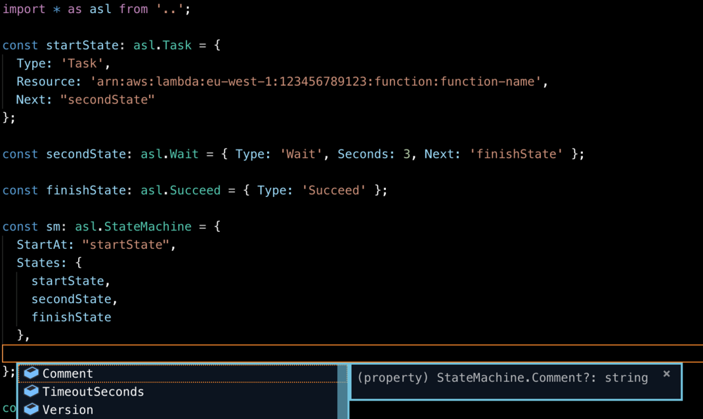

# asl-types

*asl-types* is a TypeScript types module that makes it easier to create AWS Step Functions JSON ([Amazon States Language](https://docs.aws.amazon.com/step-functions/latest/dg/concepts-amazon-states-language.html)).



## Usage

```sh
npm install asl-types --save
```

```ts
import * as asl from 'asl-types'

const sm: asl.StateMachine = {
   ...
}

...

const stepFunctionJson = JSON.stringify(sm)
```

## About

This module does very little! It generates TypeScript definitions using the following great projects.

- [asl-validator](https://github.com/airware/asl-validator) - this module provides a JSON Schema for ASL (Amazon States Language)
- [json-schema-to-typescript](https://github.com/bcherny/json-schema-to-typescript)

`asl-types` makes some minor modifications to the JSON Schema to get the best results currently possible. See [convert.ts](src/convert.ts) for details.

## Contributions

- This is a set of interfaces right now. It might be useful to create a set of classes from these types.
- Validation of cardinality rules, particularly for `Choice` states, are not as strict as we would like. This relates to an issue in `json-schema-to-typescript` ([#96](https://github.com/bcherny/json-schema-to-typescript/issues/96)). Contributions to address this issue are really welcome. This could be a resolution to that issue or an alternative solution in `asl-types`.  See the issue description for details and possible workarounds.

## LICENSE

[MIT](./LICENSE)

Copyright (c) 2019 fourTheorem Ltd.

